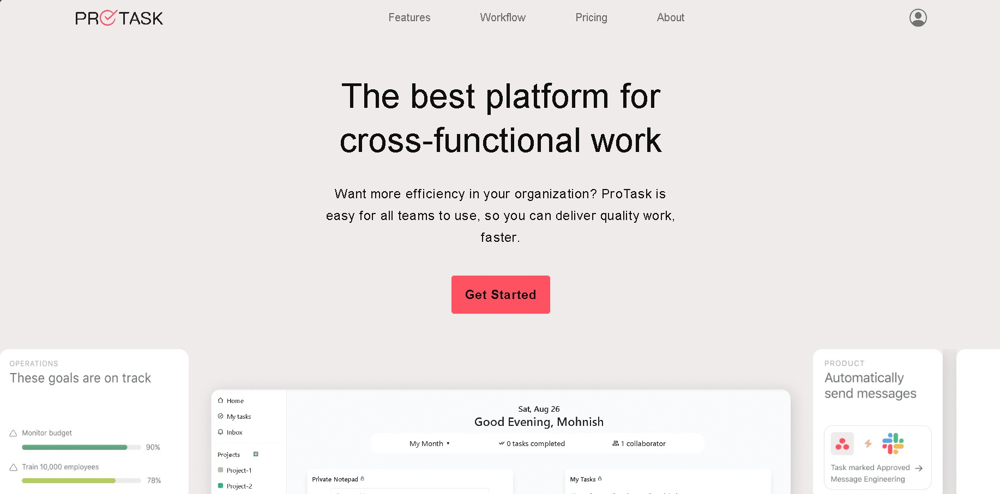
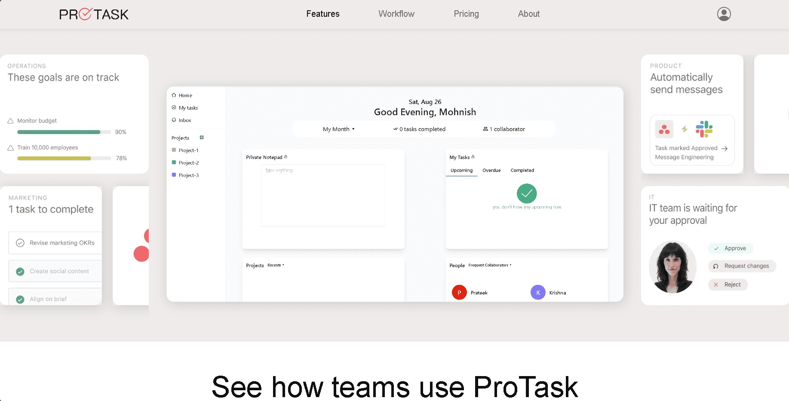
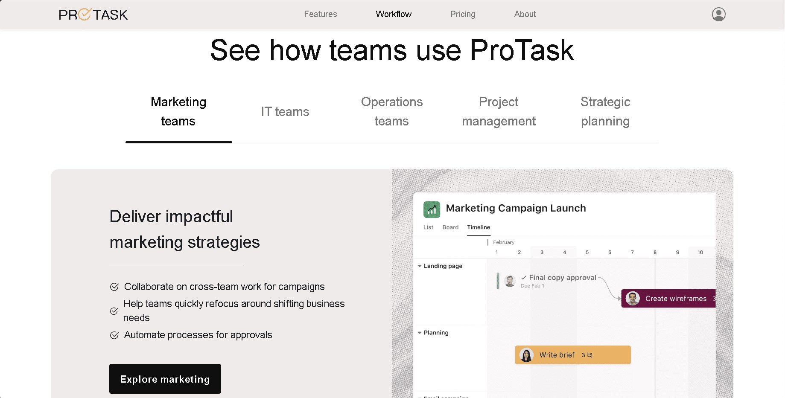
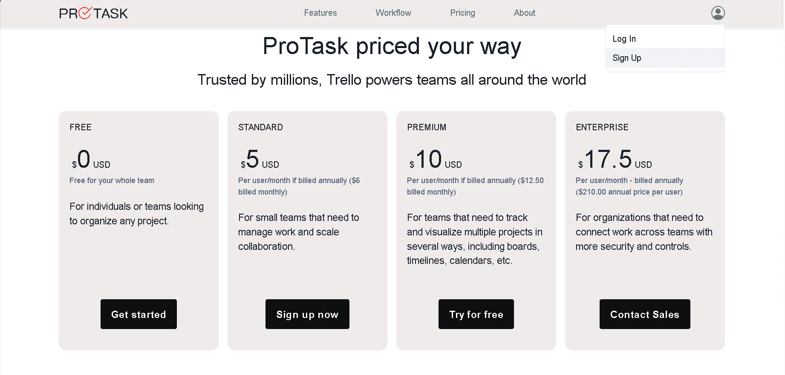
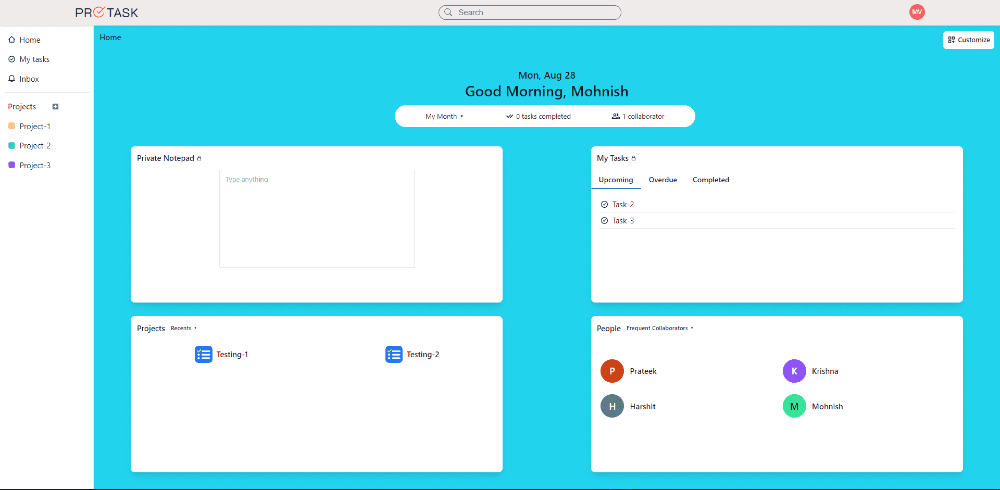
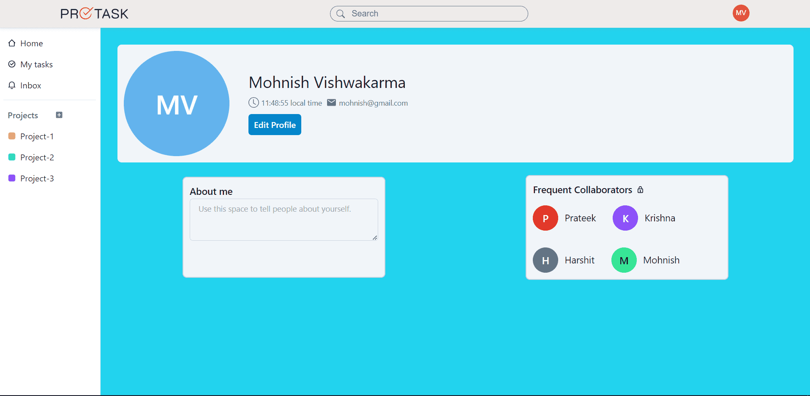
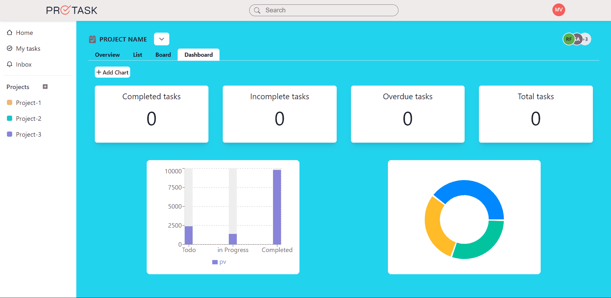

# ProTask

## What is ProTask about?

ProTask is designed for efficient task and project management. Seamlessly organize, track, and prioritize tasks while overseeing the progress of complex projects. ProTask's intuitive interface fosters collaboration, ensuring your team stays aligned and projects stay on course. Elevate your project management experience with ProTask.

## Features :-

- Users can SignUp and LogIn.
- Registered users can create new projects.
- Projects can be assigned to other users also.
- Assigned users can contribute to project created by the User.
- Members can see the overview of the project i.e: Completed, UnderProgress etc.
- Users can proceed to checkout and complete their purchase.


## Tech Stacks Used :-

Nodejs / Express / npm / MongoDB

## Installation :-

## Start The Back-End Server
- Install Dependencies :
```
cd backend
```
```
npm install
```
- Create .env file and add :-
```
mongodbUrl = Your MongoDB URL

PORT = Port Number

accessSecretKey = Your Access Secret Key

refreshSecretKey = Your Refresh Secret Key
```
- Start the Back-End Server :
```
npm run server
```










